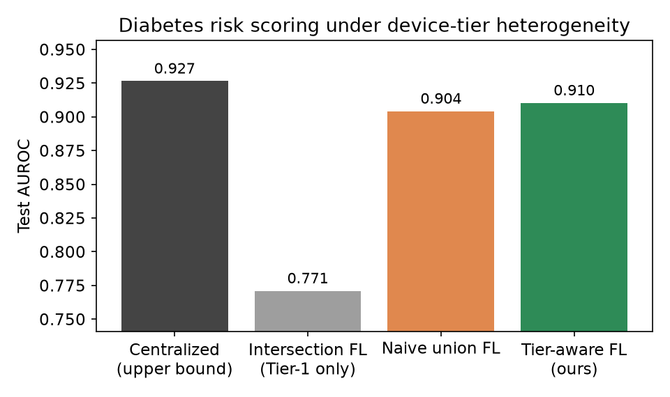
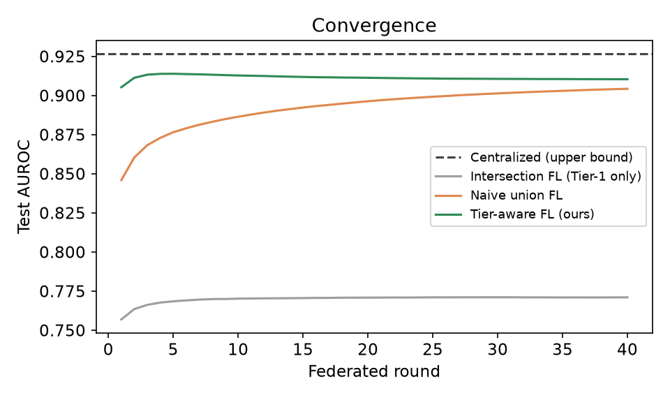

# FedHet — Federated Diabetes-Risk Scoring under Device-Tier Heterogeneity

[](https://github.com/balkeumlabs/FedHet/actions/workflows/ci.yml)
[](LICENSE)
[](https://www.python.org/)
[-brightgreen.svg)](https://wwwn.cdc.gov/nchs/nhanes/)

Reproducible research artifact for the Balkeum Labs paper *"Device-Tier
Heterogeneity in Federated Health-Risk Scoring: A Measured Study on Consumer Edge
Nodes"*, **AIBThings 2026** (IEEE Int. Conf. on AI, Blockchain, and IoT). CPU-only,
no GPU, no LLM, and **real public data only** (NHANES) — no synthetic data, no
differential privacy.

> **Problem.** In a real edge-health deployment (the HealthSync Green Box), homes
> buy different *hardware tiers*, so different homes can physically measure
> different biometrics. Standard federated averaging assumes every client shares
> the same feature space — which this *device-tier feature heterogeneity* breaks.
>
> **Result.** Handling heterogeneity naively (training only on the features
> **every** home has) throws away **15.6 AUROC points**. A simple **tier-aware**
> aggregation — averaging each weight only over the homes whose devices observe
> that feature — recovers **+13.9 points**, lands **within 1.6 points of the
> centralized upper bound**, and converges in **2 rounds instead of 26** — even
> though only ~25% of homes own the top-tier (CGM) device. All measured on a
> consumer CPU: **~0.3 s**, **~6.6 J** of real package energy, **44 bytes** uplink
> per home per round, and **zero raw-data egress**.

## Quick start

```bash
git clone https://github.com/balkeumlabs/FedHet.git
cd FedHet
bash scripts/reproduce.sh
```

That creates a virtualenv, downloads NHANES from the CDC, builds the cohort,
runs every method, and compares your numbers against the published ones. Total
runtime is about **2 minutes**, most of it the ~26 MB download; the experiment
itself takes **under 10 seconds** on a consumer CPU. Your run is written to
`runs/local/`, so the published artifacts in `results/` and `figures/` are never
overwritten.

## TL;DR results

| Method | Test AUROC | AUPRC | Gap vs centralized | Rounds to converge |
|---|---|---|---|---|
| Centralized (upper bound) | **0.927** | 0.733 | — | — |
| Intersection FL (Tier-1 only) | 0.771 | 0.330 | −15.6 pp | 3 (stuck) |
| Naive union FL | 0.904 | 0.675 | −2.2 pp | 26 |
| **Tier-aware FL (ours)** | **0.910** | 0.692 | **−1.6 pp** | **2** |

*Rounds to converge* = the first round whose test AUROC is within **0.5 AUROC
points** of the value that method reaches at the final round. It is derived from
the per-round curves stored in [`results/results.json`](results/results.json)
under `histories`; `scripts/verify_results.py` recomputes it, and a unit test
asserts this table still matches that file.

Per-tier marginal contribution (drives a fair, FLAI-style reward ladder):
Tier 1 **+5.0 pp**, Tier 2 **+1.0 pp**, Tier 3 (CGM) **+14.6 pp** AUROC — monotone,
and tracking the product's 10 % / 18 % / 25 % premium-credit ladder.




## The setup

* **Data:** NHANES 2015–2016 + 2017–2018, adults (age ≥ 20), complete-case
  (n = 9,360; diabetes prevalence ≈ 15 %). See [`data/README.md`](data/README.md).
* **Label:** physician-diagnosed diabetes (`DIQ010`). A genuine condition label,
  not derived from any feature.
* **Devices → features → tiers** (mirrors the product hardware tiers):

  | Tier | Device added | Features | Cumulative AUROC |
  |---|---|---|---|
  | *profile* | (app setup) | age, sex, smoker | 0.72 |
  | **T1** Core | smart scale + BP cuff | + BMI, weight, systolic, diastolic, pulse | 0.77 |
  | **T2** Advanced | + InBody body-composition scale | + waist | 0.78 |
  | **T3** Total Vital | + CGM | + HbA1c | 0.93 |

  Lower tiers do *non-invasive* risk estimation (~0.78 AUROC, in line with
  published scores such as FINDRISC/ADA); the CGM tier measures the glycemic
  biomarker directly (~0.92, the clinical gold standard).

* **Federation:** 60 homes are drawn; homes that receive an empty shard from the
  Dirichlet split are dropped, leaving **59** with data (25 / 19 / 15 at tiers
  1 / 2 / 3). Shards are label-skewed (Dirichlet, α = 0.5) — the standard non-IID
  model — and tier assignment is independent of the data.
* **Model:** plain logistic regression (NumPy), trained with FedAvg. A linear
  model is deliberate — it federates cleanly, trains in milliseconds on a CPU, and
  lets us mask features exactly to the device a home owns.
* **Privacy substrate:** only model weights / aggregate statistics ever leave a
  home; under secure multi-party computation (SMPC) the server sees only the
  masked sum. SMPC is the assumed privacy layer, not the focus of this study.
* **Incentive tie-in:** per-tier marginal value is turned into a normalized reward
  ladder, mirroring the on-chain reward logic of Balkeum's FLAI Protocol. This is
  computed analytically — no blockchain deployment is required.

### Methods compared

* **Centralized** — pool all data + all features (relative upper bound).
* **Intersection FL** — standard FedAvg on the feature set *every* home has
  (profile + Tier 1); richer-tier signals are discarded.
* **Naive union FL** — full feature superset, but plain FedAvg averages every
  weight over *all* homes, so homes lacking a feature dilute it.
* **Tier-aware FL (ours)** — full superset with **per-feature, participation-
  weighted** aggregation: each weight is averaged only over the homes whose
  devices observe that feature.

The one-line difference between the last two lives in
[`src/federated.py`](src/federated.py): the aggregation denominator is either the
global sample count (naive) or the per-feature participating sample count
(tier-aware).

## Reproduce

CPU-only; developed and measured on an AMD Ryzen 5 5500GT (6C/12T), 62 GB RAM,
Ubuntu 24.04 LTS, Python 3.12. No GPU is used at any point.

```bash
bash scripts/reproduce.sh
```

or step by step:

```bash
python -m venv .venv && source .venv/bin/activate
python -m pip install -r requirements.txt
python src/download_nhanes.py     # fetch raw NHANES .xpt from CDC (~26 MB)
python src/build_dataset.py       # -> data/nhanes_cohort.csv
python src/run_experiment.py      # -> results/*.json,*.csv and figures/*.png
```

`run_experiment.py` writes to `results/` and `figures/` by default, which
overwrites the published artifacts in your working tree. Either restore them with
`git checkout -- results/ figures/`, or send your run elsewhere:

```bash
python src/run_experiment.py --out-dir runs/mine --fig-dir runs/mine/figures
```

Outputs are deterministic: every reported quantity except energy reproduces
bit-for-bit from the fixed seed (`--seed 42`).

### Verifying a reproduction

```bash
python scripts/verify_results.py --candidate runs/mine/results.json
```

This compares your run against the published `results/results.json` and exits
non-zero on any mismatch. It checks the cohort and configuration, all four
methods' AUROC / AUPRC / Brier / accuracy, the derived gap and recovery claims,
rounds-to-converge, the per-tier contribution ladder, the exact communication
accounting, and the scaling sweep — 70 checks in total.

Energy is deliberately **reported but not compared**: package energy depends on
the host CPU, so a reproduction on other hardware is expected to differ. The
script prints both runs' `energy_source` so a TDP estimate is never silently
compared against a measurement.

You can also confirm you got the same input data:

```bash
sha256sum -c data/CHECKSUMS.sha256
```

A mismatch means CDC has re-released that NHANES component since this study ran.

### Reproducing the energy measurement

The published energy figures are **measured**, read from the Linux powercap RAPL
package domain — the same method as Balkeum's CEM26 study on this hardware.

On most current distributions `energy_uj` is mode `0400` root-only, a mitigation
for the PLATYPUS side-channel (CVE-2020-8694). Grant read access before the run:

```bash
sudo chmod o+r /sys/class/powercap/intel-rapl:*/energy_uj
```

Without it the harness still runs, but it prints a prominent warning, falls back
to a 65 W TDP × wall-clock estimate, and tags every affected number
`energy_source: "tdp_estimate"`. **A TDP estimate is not a measurement** and is
not comparable to the figures reported in the paper. Every energy value in
`results/results.json` carries its source, and a unit test asserts the published
run used `rapl`.

On hardware without a readable RAPL interface at all (most macOS and Windows
hosts, many VMs and containers), the learning results still reproduce exactly;
only the energy column is unavailable.

## Repository layout

```
src/
  config.py           device -> feature -> tier mapping; label definition
  download_nhanes.py  fetch raw NHANES files from the CDC public server
  build_dataset.py    merge components on SEQN -> complete-case cohort
  partition.py        split into homes, assign tiers, apply feature masks
  models.py           NumPy logistic regression with per-feature gradient masking
  federated.py        federated scaler + the 3 aggregation strategies
  contribution.py     per-tier marginal contribution / reward ladder
  measure.py          RAPL energy, CPU time, communication accounting
  run_experiment.py   orchestrates everything; writes results + figures
scripts/
  reproduce.sh        end-to-end: download -> build -> run -> verify
  verify_results.py   compare a run against the published results.json
tests/                unit tests + README/results consistency checks
results/              results.json, comparison.csv  (the published run)
figures/              fig1..fig4 (.png)             (the published run)
data/                 README, CHECKSUMS.sha256 (raw data are downloaded, not committed)
```

## Development

```bash
python -m pip install -r requirements-dev.txt
ruff check src scripts tests     # lint
python -m pytest                 # 69 unit + consistency tests, < 1 s
```

The test suite covers the aggregation arithmetic (including the exact dilution
the paper reports), gradient masking, federated standardization, the non-IID
partition, and the energy labelling — and asserts that the numbers in this README
still match `results/results.json`. See [CONTRIBUTING.md](CONTRIBUTING.md).

## Honesty notes & limitations

* **Real data only.** Every value is a measured NHANES value; tier heterogeneity
  is imposed by *masking* devices a home lacks, never by altering data. The unit
  tests use small hand-built arrays to pin arithmetic invariants; no test result
  feeds any reported number.
* **Why diabetes, not a "polypharmacy" feature.** An earlier design used
  medication count as a "smart-pillbox" proxy; we dropped it because for a
  prevalence label it is diagnosis-adjacent (reverse causation) and inflates the
  top tier artificially. Tier 3's signal is the CGM glycemic measurement.
* **Homes are simulated.** Real records are partitioned into shards; we do not
  have per-household longitudinal data. Tier assignment is random and independent
  of the data, so it cannot manufacture the effect we report.
* **Cross-sectional.** NHANES is cross-sectional; this is risk *stratification*,
  not incident-risk prediction.
* **One optimizer throughout.** Centralized, intersection, naive-union and
  tier-aware all use the same full-batch gradient descent, so the comparison is
  like-for-like. The centralized row is therefore a *relative* upper bound under
  this optimizer, not the best achievable AUROC on these features.
* **A CGM does not measure HbA1c.** HbA1c is the NHANES-available glycemic
  biomarker and stands in for the Tier-3 continuous glucose signal; it is the
  physiological quantity a CGM tracks, not the exact readout a CGM reports.
* **Energy is machine-specific.** The 6.6 J figure is a RAPL package measurement
  on one AMD Ryzen 5 5500GT; it is a real measurement, not a model, and it will
  differ on other hardware.
* **Blockchain is analytical.** The reward ladder mirrors the FLAI Protocol's
  on-chain settlement logic; no chain is deployed here.
* **Not a medical device.** Research artifact only; no clinical claims.

## Citing this work

```bibtex
@inproceedings{yune2026fedhet,
  title     = {Device-Tier Heterogeneity in Federated Health-Risk Scoring:
               A Measured Study on Consumer Edge Nodes},
  author    = {Yune, Eli and Majeed, Umer and Balan, Mahesh},
  booktitle = {2026 IEEE International Conference on Artificial Intelligence,
               Blockchain, and Internet of Things (AIBThings)},
  year      = {2026}
}
```

Machine-readable metadata is in [CITATION.cff](CITATION.cff).

## Authors

- **Eli Yune** ([@yune1ha](https://github.com/yune1ha)) — Balkeum Labs
- **Umer Majeed** ([@umerblabs](https://github.com/umerblabs)) — Balkeum Labs
- **Mahesh Balan** ([@maheshbalan](https://github.com/maheshbalan)) — Claremont Graduate University

## License

Code: [MIT](LICENSE), © 2026 Balkeum Labs. NHANES data are U.S. public-domain and
are redistributed by no part of this repository; the scripts fetch them from the
CDC at run time.
